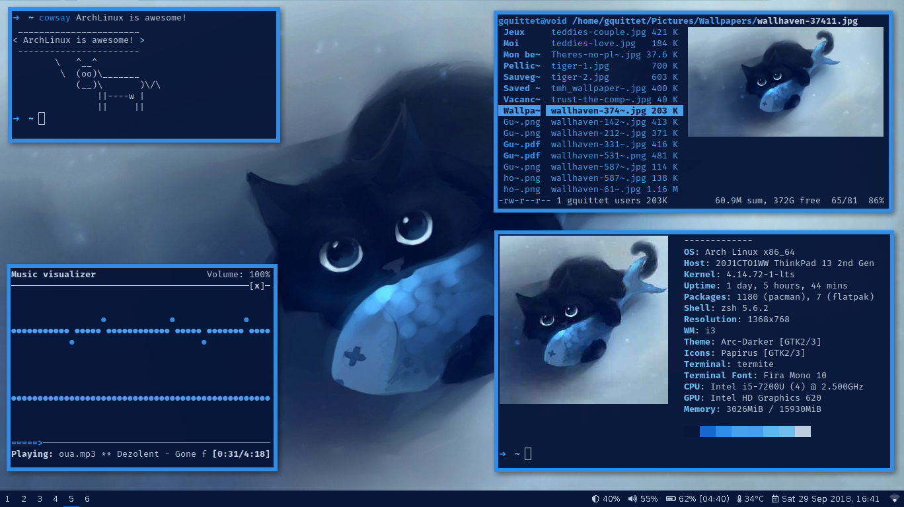

# My dotfiles

In this repository, you can find all my dotfiles.

## Who Am I?

- **Name** : Guillaume Quittet
- **Age** : 21 years old
- **Passions** : All that includes computers (FullStack Development, DevOps, Security, ...), basketball and cats
- **Big Projects** :
    - **Nexodeler** : A remote controller for the NAO robot ([https://github.com/gquittet/nexodeler](https://github.com/gquittet/nexodeler))
    - **HEH-Beamer** : A LaTeX framework to making simply presentation with Beamer ([https://github.com/gquittet/HEH-Beamer](https://github.com/gquittet/HEH-Beamer))
    - **SenseSnake** : An implementation in Python3 of the Snake with a custom graphical engine for the Sense Hat ([https://github.com/gquittet/SenseSnake](https://github.com/gquittet/SenseSnake))
    - **AndroidS7Manager** : A manager for the automates of the Siemens brand ((https://github.com/gquittet/AndroidS7Manager)[https://github.com/gquittet/AndroidS7Manager])
    - **Myworld** : My old dotfiles ((https://github.com/gquittet/myworld)[https://github.com/gquittet/myworld])
    - and many others private projects.

## Tools I use to sync

- **[GNU/Stow](https://www.gnu.org/software/stow/)** - A great tool to manage your dotfiles from a main folder.
- **[Syncthing](https://syncthing.net/)** - To sync my computer files into my smartphone.

## My workflow

- **Laptop** : ThinkPad 13 2nd Gen (20J1)
- **Operating System** : [ArchLinux](https://www.archlinux.org/)
- **Display Manager** : None
- **Desktop Environment** : None
- **Window Manager** : [i3](https://i3wm.org/)
- **Screen Compositor** : [compton](https://github.com/chjj/compton)
- **System Bar** : [polybar](https://github.com/jaagr/polybar)
- **Color scheme** : [pywal](https://github.com/dylanaraps/pywal)
- **Text Editor** : [NeoVim](https://neovim.io/), [GNU/Emacs](https://www.gnu.org/software/emacs/) and [Sublime Text](http://www.sublimetext.com)
- **Music Player** : [MPD](https://github.com/MusicPlayerDaemon/MPD) with [NCMPCPP](https://github.com/arybczak/ncmpcpp)
- **File Manager** : [ranger](https://github.com/ranger/ranger) and [PCManFm](https://wiki.lxde.org/en/PCManFM)

